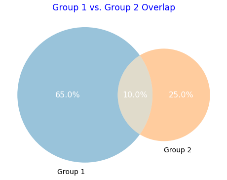
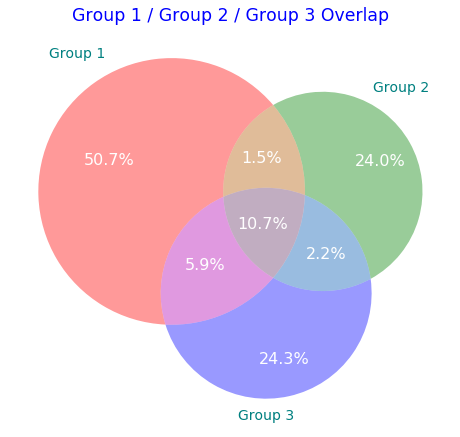

# Venn-Gogh
I noticed the limitation of online generator for Venn diagram while I was working on my visualisation for overlaps between 2 group; circles are not drawn in proportion to their values / lack of customisation to blend the Venn diagram into presentation slides.  

An option would be to manually draw out a Venn diagram that suit my need, but it would be time consuming and not reproducible should I want to make changes or generate more charts.

Using the available Python packages, I wrote up a script which allow user to create meaningful Venn diagram that are proportional to the group's value, with the ability for the user to customise the chart. For now it is hosted on Jupyter notebook due to the ease of launching and quickly generating the Venn diagram.

### General Code Dependencies

- Check py37_requirements.txt for dependencies

### Future Works

If the time and resources allow, I will host this Venn diagram generator on a web server, allowing non technical users to customize & generate Venn diagram.

#### <u>Example</u>

#### **Venn Diagram (2 Group)**


```python
# Group1 vs Group2 (input here)
group1 = 0.65
group2 = 0.25
overlap = 0.1
labels = ["Group 1", "Group 2"]
chart_title = "Group 1 vs. Group 2 Overlap"

# plot venn diagram
plt.figure(figsize=(8,10), facecolor='None') #set chart area and background colour
venn_chart = venn2(subsets=[group1, group2, overlap],  
                   set_labels=(labels),  
                   set_colors=['#006ba4', '#ff800e'], #change circle's colour
                   subset_label_formatter=lambda x: f"{x:1.1%}") 
for text in venn_chart.set_labels:
    text.set_fontsize(14) #set label's fontsize 
    text.set_color('black') #set label's font colour
for text in venn_chart.subset_labels:
    text.set_fontsize(16) #set circle's value fontsize 
    text.set_color('white') #set circle's value font colour
    text.set_alpha(1) #set circle's value font transparency
plt.title(chart_title, fontsize='xx-large', color='blue') #set title

```



#### **Venn Diagram (3 Group)**


```python
# Group1 vs Group2 vs Group3 (input here)
group1 = 0.5075
group2 = 0.24
group3 = 0.2427
overlap_grp1_2 = 0.015
overlap_grp2_3 = 0.0225
overlap_grp3_1 = 0.0585
overlap_grp_all = 0.1067

labels = ["Group 1", "Group 2", "Group 3"]
chart_title = "Group 1 / Group 2 / Group 3 Overlap"

# plot venn diagram
plt.figure(figsize=(8,10), facecolor='None') #set chart area and background colour
venn_chart = venn3(subsets=[group1, group2, overlap_grp1_2, group3, overlap_grp3_1, overlap_grp2_3, overlap_grp_all],  
                   set_labels=(labels),  
                   subset_label_formatter=lambda x: f"{x:1.1%}") 
for text in venn_chart.set_labels:
    text.set_fontsize(14) #set label's fontsize 
    text.set_color('teal') #set label's font colour
for text in venn_chart.subset_labels:
    text.set_fontsize(16) #set circle's value fontsize
    text.set_color('white') #set circle's value font colour
    text.set_alpha(1) #set circle's value font transparency, 0 as full transparent
plt.title(chart_title, fontsize='xx-large', color='blue') #set title

```



### 

